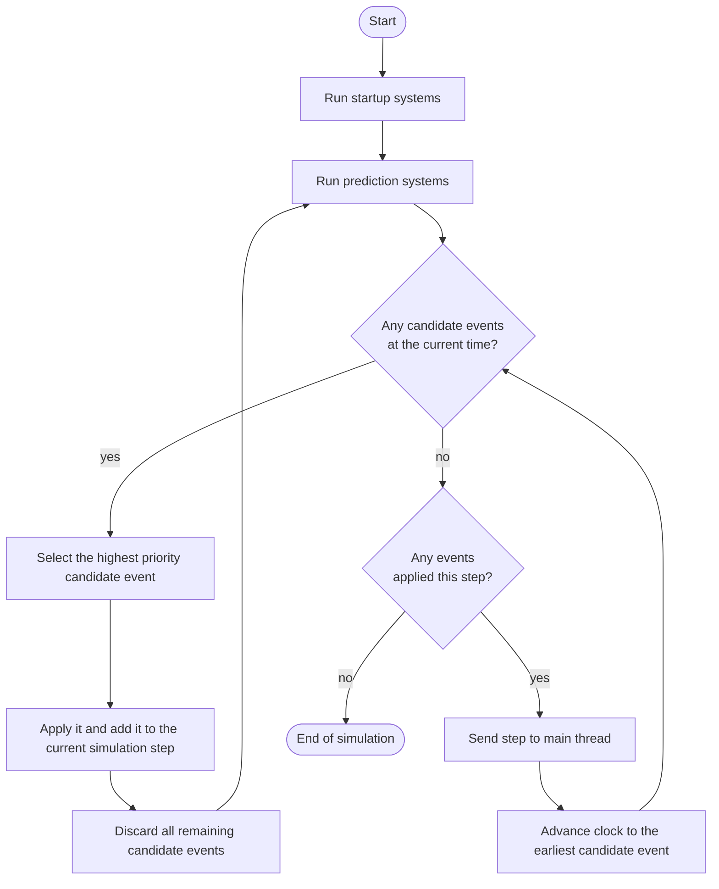

# rmf_site_sim

Discrete event simulation for the [rmf_site_editor](https://github.com/open-rmf/rmf_site).

## Simulation Flow

```mermaid
flowchart TD
    start([Start]) --> startup["Run startup systems"]
    startup --> predict


    due{"Any candidate events<br/>at the current time?"}
    due -- yes --> select["Select the highest priority candidate event"]
    select --> apply["Apply it and add it to the current simulation step"]
    apply --> discard["Discard all remaining candidate events"]
    discard --> predict["Run prediction systems"]
    predict --> due
    due -- no --> applied{"Any events<br/>applied this step?"}
    applied -- yes --> send["Send step to main thread"]

    send --> advance["Advance clock to the earliest candidate event"]
    applied -- no --> done(["End of simulation"])

    advance --> due
```
